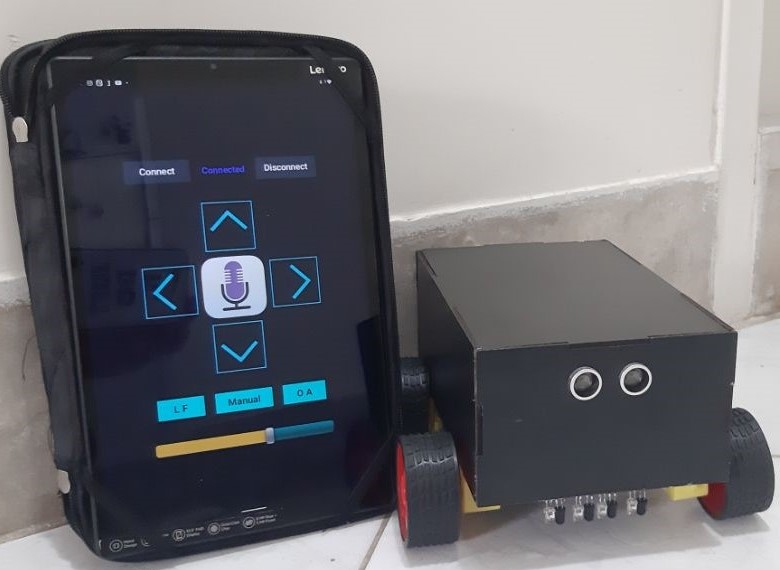
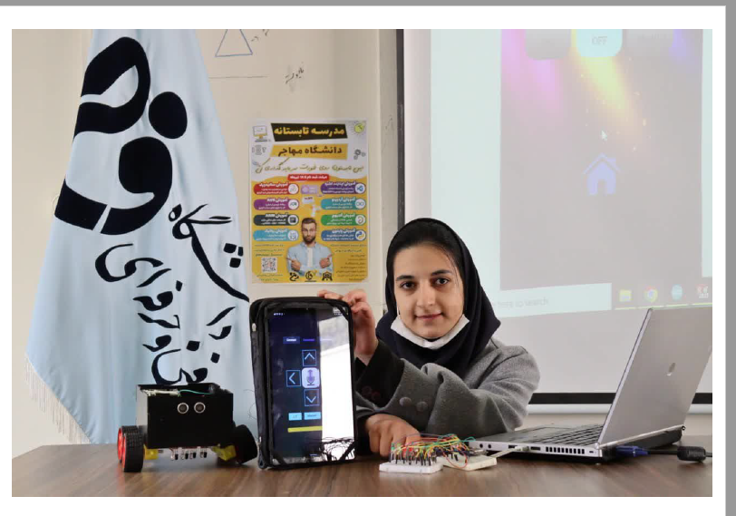

# voice-intelligent-robot

**Intelligent Autonomous Robotic System with Voice Control**

- Designed and built a modular mobile robot integrating an Android-based voice command interface and real-time manual controls.
- Engineered the communication bridge between a mobile interface and the robot’s hardware controller for low-latency command execution.
- Engineered the hardware-software communication bridge to translate natural language into motor actions for precise navigation.
- Developed a specialized tablet-based control application with three operational modes: Line Following (LF), Obstacle Avoidance (OA), and Voice Command Integration.

My presentation at Esfahan Province Technical and Vocational University
